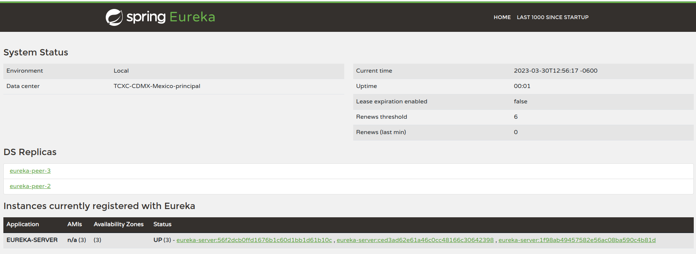

<div align="center"> 
  
</div>
<div> 
  <h1 align="center">Eureka Server</h1>
  <p>
    Es una herramienta de registro y descubrimiento de servicios desarrollada por Netflix que se utiliza para facilitar la 
comunicación entre diferentes servicios en una arquitectura de microservicios. En términos simples, Eureka Server es una
especie de directorio de servicios que permite a los microservicios registrarse, descubrir y comunicarse entre sí.
  </p>
</div>

## Comenzando
Estas instrucciones te permitirán obtener una copia del proyecto en funcionamiento en tu máquina local para propósitos
de desarrollo y pruebas.

## Requisitos

<div style="text-align: center;">
    <span style="display:inline-block">
        
    </span>
    <span style="display:inline-block">
        
    </span>
    <span style="display:inline-block">
        
    </span>
    <span style="display:inline-block">
        
    </span>
</div>

* Java v17 o superior
* Spring Cloud v2022.0.1 o superior
* docker-compose v1.25.4 o superior

## Instalación

Para poder instalar el proyecto de manera local, se debe ejecutar la instrucción en una terminal, las siguientes instrucciones:

* Instalar las dependencias de este proyecto.
```bash
mvn clean install -DskipTests
```
* Pasar las vairables de entorno

1. Haga clic en **Editar configuraciones** en la barra de herramientas de Intellij.
2. En la ventana emergente, haga clic en el botón "+" para agregar una nueva configuración y seleccione **Ejecutar/Debug**.
3. En la pestaña **Configuración**, escriba un nombre para su configuración en el campo **Nombre**.
4. En el campo **Main class**, especifique la clase principal de este proyecto.
5. En la sección **Variables de entorno**, haga clic en el botón "+" para agregar una nueva variable de entorno.
6. En el campo **Nombre**, escriba el nombre de la variable de entorno y en el campo **Valor**, escriba el valor de la variable de entorno.
7. Haga clic en **Aceptar** para guardar la configuración.
8. Hacer clic en **Run** 

*Nota: Estas instrucciones son para desplegar el proyecto con una unica instancia*

* O bien se puede desplegar con docker
1. Exportar las variables de entorno que necesitan los contenedores
```bash
export ENV_FILE=/path/to/locate/file/.env
export ENV_FILE_PEER_II=/path/to/locate/file_peerI/.env
export ENV_FILE_PEER_III=/path/to/locate/file_peerII/.env
```

3. Ejecutar la instruccion de despliegue
```bash
docker-compose down --rmi all --remove-orphans && docker-compose build --no-cache && docker-compose --compatibility up -d
```

## Pruebas

Abre el navegador y escribe la direccion `http://localhost:8000`, `http://localhost:8001` y `http://localhost:8002` donde
el puerto 8000 es la instancia principal y 8001, 8002 son las instancias adicionales.



## Funcionamiento

Al tener tres instancias adicionales, se puede configurar un equilibrador de carga que distribuya las solicitudes entre 
las tres instancias adicionales. Esto proporciona redundancia y escalabilidad adicional en caso de que alguna instancia 
falle o se sobrecargue. Es importante tener en cuenta que la cantidad de instancias y servidores principales que se 
necesitan dependerá de las necesidades específicas de **tu aplicación** y la carga que se espera manejar. Si bien tres 
instancias pueden ser suficientes para algunos casos de uso, en otros casos puede ser necesario agregar más instancias 
para manejar una carga mayor.

### Beneficios

* **Escalabilidad:** Eureka Server es altamente escalable, lo que significa que puede manejar grandes cantidades de 
servicios y solicitudes simultáneamente.
* **Alta disponibilidad:** Eureka Server utiliza un modelo de alta disponibilidad, lo que significa que puede tolerar
fallas y garantizar que los servicios estén disponibles y funcionando en todo momento.
* **Descubrimiento de servicios:** Eureka Server permite a los servicios registrarse y descubrir otros servicios de 
forma dinámica, lo que facilita la comunicación entre los diferentes componentes de una aplicación.
* **Configuración centralizada:** Eureka Server proporciona una ubicación centralizada para almacenar la configuración 
de los servicios, lo que simplifica la gestión de la configuración y reduce la complejidad de la implementación.

### Desventajas y limitaciones
* **Dependencia de Netflix:** Eureka Server fue desarrollado por Netflix y es una tecnología patentada, lo que significa
que su uso puede estar limitado a las organizaciones que utilizan tecnologías y herramientas similares a las de Netflix.
* **Complejidad:** La configuración y la gestión de Eureka Server pueden ser complejas, especialmente para aplicaciones 
más grandes y complejas.
* **Latencia:** Eureka Server puede agregar un poco de latencia a la comunicación entre servicios debido a que implica 
una llamada adicional a la API de descubrimiento de servicios.
* **Seguridad:** Eureka Server no proporciona autenticación ni seguridad de forma predeterminada, por lo que puede ser 
necesario agregar capas adicionales de seguridad para garantizar la protección de los datos y la información de la 
aplicación.

## Configuraciones

A continuacion se listan las tablas de configuraciones con los valores mas adecuados y provados para el desplieuge de un
cluster de eukera con 3 instancias y estan sujetos a cambios segun las necesidades y las buenas practicas para el desarrollo
de las APIS


A continuación se muestra un ejemplo de configuracion para un cliente de eureka.
* Archivo application.propperties del cliente, recuerda que los valores deben de estar registrarse en un archivo (.env)

```properties
...
eureka.client.serviceUrl.defaultZone=http://eureka-server:8000/eureka/,http://eureka-peer-2:8001/eureka/,http://eureka-peer-3:8002/eureka/
eureka.client.serviceUrl.initialInstanceInfoReplicationIntervalSeconds=30
eureka.client.serviceUrl.registryFetchIntervalSeconds=5
eureka.client.registerWithEureka=true
eureka.client.fetchRegistry=true
#Configuracion disponibles con sping web reactive
eureka.client.healthcheck.enabled=true
eureka.client.healthcheck.interval=10
eureka.client.healthcheck.timeout=5
#Configuracion disponibles con sping web reactive^
eureka.instance.preferIpAddress=false
eureka.instance.instanceId=${spring.application.name}:${random.value}
eureka.instance.hostname=mi-super-aplicacion
eureka.instance.leaseRenewalIntervalInSeconds=20
eureka.instance.leaseExpirationDurationInSeconds=90
eureka.instance.renewal-interval-in-seconds=30
...
```
* Archivo pom del cliente
```xml
...
<dependency>
    <groupId>org.springframework.cloud</groupId>
    <artifactId>spring-cloud-starter-netflix-eureka-client</artifactId>
    <exclusions>
        <exclusion>
            <groupId>org.springframework.cloud</groupId>
            <artifactId>spring-cloud-starter-ribbon</artifactId>
        </exclusion>
        <exclusion>
            <groupId>com.netflix.ribbon</groupId>
            <artifactId>ribbon-eureka</artifactId>
        </exclusion>
    </exclusions>
</dependency>
...
```
* Archivo compose de Docker del cliente
  * Para el balanceo de carga solo se le debe quitar el argumento container_name y port del archivo.
```yaml
version: '3.7'
services:
  mi-super-aplicacion:
    container_name: mi-super-aplicacion
    hostname: mi-super-aplicacion
    ...
```

* Archivo Healtcheck del cliente
```java
@Component
public class HealthCheck implements HealthCheckHandler {
    @Override
    public InstanceInfo.InstanceStatus getStatus(InstanceInfo.InstanceStatus currentStatus){
        switch (currentStatus){
            case OUT_OF_SERVICE:
                return InstanceInfo.InstanceStatus.OUT_OF_SERVICE;
            case DOWN:
                return InstanceInfo.InstanceStatus.DOWN;
            case STARTING:
                return InstanceInfo.InstanceStatus.STARTING;
            case UP:
                return InstanceInfo.InstanceStatus.UP;
            default:
                throw new  RuntimeException("No se reconoce el estado de la instancia" + currentStatus);
        }
    }
}
```

## Autores

* [Gustavo Hernandez][gh] - autor y documentación

--------

<div align="center"> 
  <p>
    Made with &hearts;  |  GHHH
  </p>
</div>


<!-- Inicio de enlaces de este documento -->
[gh]: https://github.com/GustavoHdezH
<!-- Fin de enlaces de este documento -->
